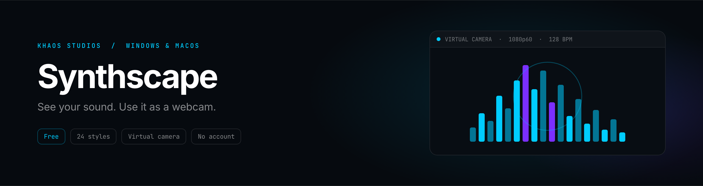

 

**[Download for Windows](https://github.com/snacbot/synthscape-releases/releases/latest/download/Synthscape-win-x64.exe)**
&nbsp;·&nbsp;
**[Download for macOS](https://github.com/snacbot/synthscape-releases/releases/latest/download/Synthscape-mac-universal.dmg)**
&nbsp;·&nbsp;
**[Website](https://khaosstudio.com/synthscape/)**
&nbsp;·&nbsp;
**[Release notes](https://github.com/snacbot/synthscape-releases/releases)**

---

## What Synthscape is

Synthscape turns whatever you're listening to into something worth looking at, then registers itself as a webcam so other apps can see it too. Flip the virtual camera on and Discord, Zoom, Teams, Meet, OBS, and Streamlabs treat it like any USB camera. No plugins, no browser sources, and nobody else on the call has to install a thing.

We built it because one of us wanted to watch a playlist instead of just listening to it. The webcam part came later, from a run of standups where every square on the grid was a static avatar.

Twenty four styles ship in the box, all in the same renderer, all switchable mid-song. Beat detection runs on spectral flux over a 2048-sample FFT, so the visuals lock to what the audio is actually doing rather than to a guessed tempo. Save a look you like as a preset with a thumbnail and stop thinking about it.

## Install

**Windows 10 or later (64-bit)**

Download [`Synthscape-win-x64.exe`](https://github.com/snacbot/synthscape-releases/releases/latest/download/Synthscape-win-x64.exe) and run it. The installer is code-signed.

**macOS 11 or later**

Download [`Synthscape-mac-universal.dmg`](https://github.com/snacbot/synthscape-releases/releases/latest/download/Synthscape-mac-universal.dmg), or [`Synthscape-mac-arm64.dmg`](https://github.com/snacbot/synthscape-releases/releases/latest/download/Synthscape-mac-arm64.dmg) if you want the Apple Silicon slice on its own. Drag it to Applications. Both builds are notarized.

No account, no email, no launcher. Any GPU with WebGL 2 works, which is everything from the last decade including integrated graphics. Around 200 MB of RAM at sixty frames per second.

## What's in it

| | |
| --- | --- |
| **Virtual webcam** | A CoreMediaIO device on macOS, a DirectShow source on Windows. Video apps see a normal camera. |
| **24 styles** | Six 3D, seven lines and waves, four bar styles, seven immersive. Same renderer, switch any time. |
| **Beat detection** | Spectral flux onset detection with adaptive thresholding. BPM updates live. |
| **Presets** | Style, colors, bloom, sensitivity, and audio source saved together with a thumbnail. |
| **Now playing** | Reads the current Spotify track from the local API and fades title and artist into the render. |
| **Chroma key or true alpha** | Green, blue, or magenta for OBS, or output a real alpha channel and skip keying entirely. |
| **Widget and wallpaper** | Pin it always-on-top in a corner, or push it behind your desktop icons. |
| **Audio controls** | Smoothing, sensitivity, noise gate, low and high cuts. Swap mic and desktop audio without a restart. |

## Free, with a Pro tier

Everything interesting is in the free build: all twenty four styles, BPM detection, presets, the Spotify overlay, widget and wallpaper modes, and the virtual camera at 360p.

Pro is **$5 once**, no subscription, and unlocks 720p and 1080p camera output plus 60 fps, 120 fps, and VSync. The split isn't there to annoy you into paying, it's the features with real GPU cost on the other side of it.

## This repo

The **public release channel** for Synthscape. It ships the installers and the release notes, not the source.

Found a bug or want a twenty fifth style? [Open an issue](https://github.com/snacbot/synthscape-releases/issues) or come tell us in [Discord](https://discord.gg/UxfhSWavbQ).

## More

- **Product page:** [khaosstudio.com/synthscape](https://khaosstudio.com/synthscape/)
- **Studio:** [Khaos Studios](https://khaosstudio.com) · [Privacy](https://khaosstudio.com/privacy.html) · [Terms](https://khaosstudio.com/terms.html) · [Refunds](https://khaosstudio.com/refund.html)

## License

Synthscape is proprietary software. Copyright 2026 Khaos Studios LLC. All rights reserved.
